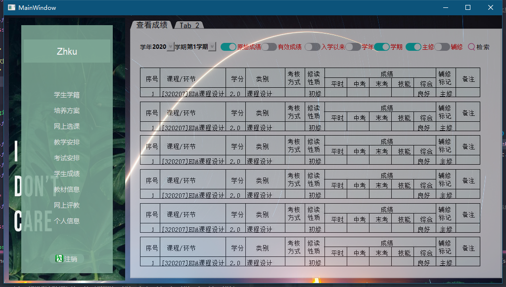
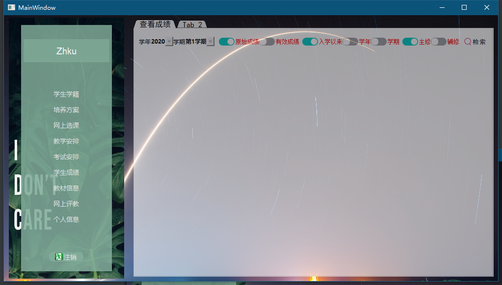
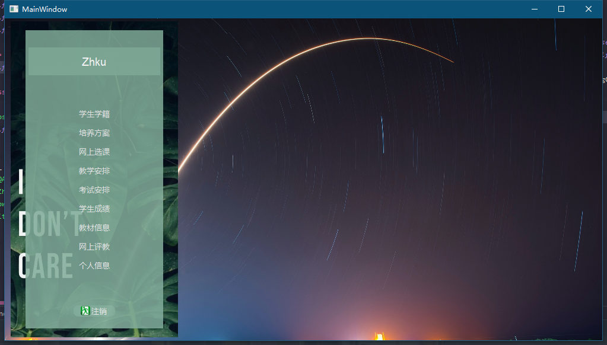
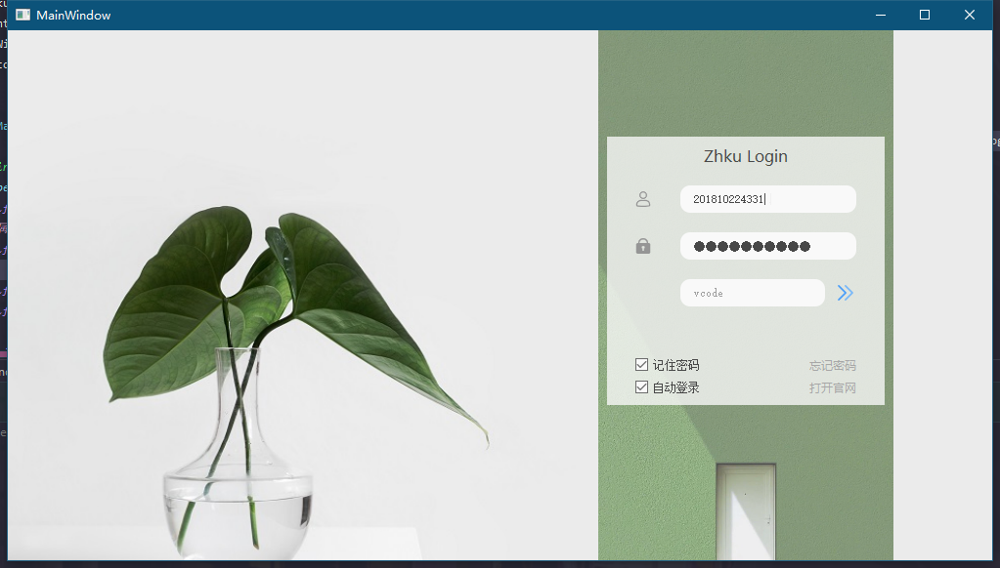

# ZHKU-Client
pyqt+spider 做的一个仲恺教务网客户端

桌面级

## 更新
- 2021年4月22日12:49:20 重新提交一次
- 2020年12月20日20:03:56 重构 并且修复巨多bug
- 2020年12月17日23:48:40 实现了查看成绩功能
- 2020年12月17日00:09:57 添加了很多功能 懒得说了哦~ 之后会慢慢恢复更新的 
- 2020年12月7日23:42:17 今天初步完成好ui界面

## 示例

按登录后有切换动画

